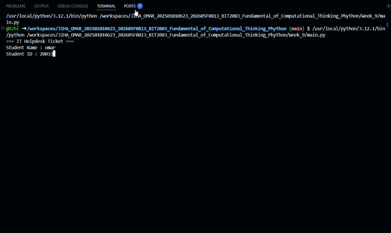

1
This application helps students to register for Helpdesk when they get issues 

2 the teach stack that we use it
Python and some modules 

3 we use this app like that 
 Run main.py

 Enter students information 

Enter issues details 

Choose the level of the issue 

The program will assign the technician 
And the ticket information will display

record for show how its work
